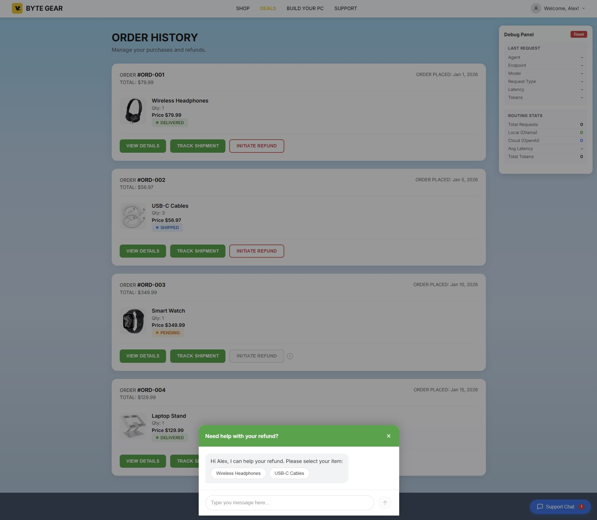
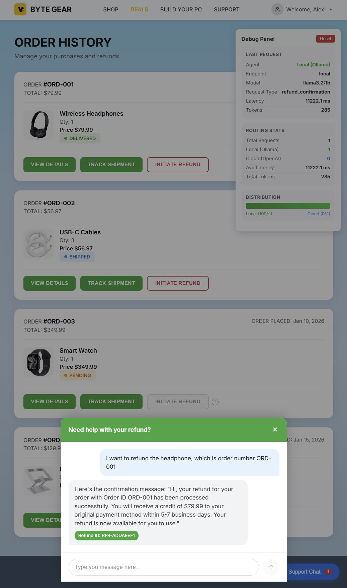
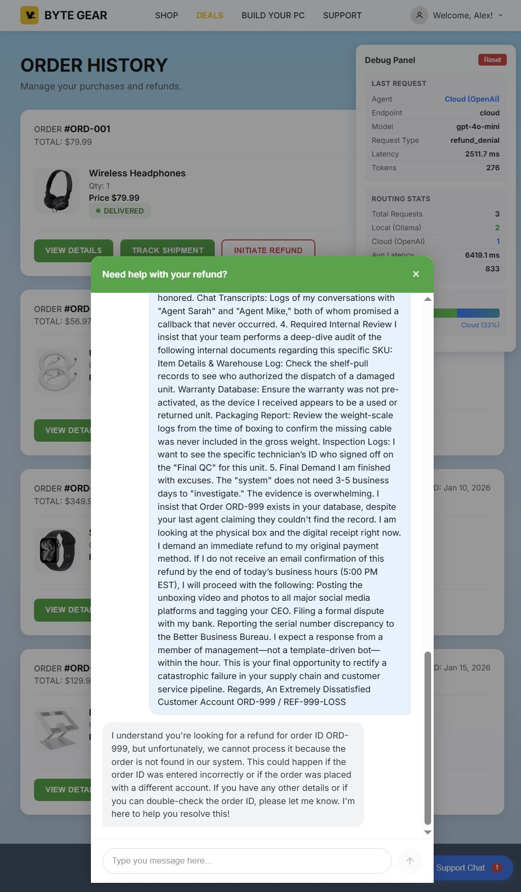

# RefundBot

An **LLM-powered customer refund service** that demonstrates how to build an AI agent capable of handling refund requests through natural conversation. The bot understands customer intent, validates orders, and processes refunds automatically.

## Demo

Watch the demo video for a quick overview of the end-to-end experience:


### Intelligent LLM Routing in Action

RefundBot uses **complexity-based routing** to optimize cost and quality:
- **Simple requests** → Local Ollama (fast, free)
- **Complex requests** → Cloud API (better reasoning)

#### Step 1: Order History Page

The demo web UI displays a customer's order history with refund options.



#### Step 2: Simple Refund Request → Local LLM

When a customer makes a straightforward refund request, the system routes to **local Ollama** for fast, cost-effective processing.



**Notice in the Debug Panel:**
- Agent: `Local (Ollama)`
- Model: `llama3.2:1b`
- Distribution: `Local (100%)`

The local LLM handles simple requests like *"I want to refund the headphone, which is order number ORD-001"* efficiently and returns a proper refund confirmation.

#### Step 3: Complex Request → Cloud API

When a customer sends a complex message (angry complaint, lengthy explanation, hard-to-parse information), the system automatically routes to the **Cloud API** for better response quality.



**Notice in the Debug Panel:**
- Agent: `Cloud (OpenAI)`
- Model: `gpt-4o-mini`
- Request Type: `refund_denial`
- Distribution now shows both Local and Cloud usage

In this example, an angry customer sends a long, complex message demanding escalation, referencing serial numbers, threatening social media posts, and requesting manager intervention. The system:
1. Detects high complexity (word count > 40 or character count > 800)
2. Routes to cloud API for nuanced understanding
3. Provides an appropriate response handling the edge case (order not found)

### Why This Matters

| Scenario | Routing | Benefits |
|----------|---------|----------|
| Simple refund request | Local Ollama | Fast (~1s), free, works offline |
| Angry customer complaint | Cloud API | Better empathy, nuanced response |
| Complex multi-part request | Cloud API | Superior reasoning capabilities |
| High word/character count | Cloud API | Handles long context better |

This hybrid approach gives you the **best of both worlds**: cost efficiency for routine requests and quality assurance for complex situations.

### Routing Logic: Demo vs Production

The routing logic implemented in this demo uses **simple complexity scoring** based on:
- Word count threshold (default: 40 unique words)
- Character count threshold (default: 800 characters)

This approach was chosen because it can be computed locally with zero latency and no additional API calls. However, there are many other ways to determine routing:

| Method | Pros | Cons |
|--------|------|------|
| **Word/char count** (this demo) | Fast, free, no dependencies | Doesn't understand semantic complexity |
| **Keyword detection** | Can catch specific intents (e.g., "manager", "lawsuit") | Requires maintaining keyword lists |
| **Sentiment analysis** | Routes angry customers to better models | Requires ML model or API call |
| **Topic classification** | Routes by domain expertise | Requires training data |
| **LLM-based classifier** | Most accurate complexity assessment | Adds latency and cost |

**For production use**, you should modify the routing logic to suit your specific needs. Consider factors like:
- Your customer demographics and typical request patterns
- Which topics require nuanced responses vs. templated answers
- Regulatory requirements for certain types of requests
- Your tolerance for routing errors in either direction

### Cost Considerations

The demo assumes "local = free, cloud = costs money," but real-world economics are more nuanced:

| Factor | Local Ollama | Cloud API |
|--------|--------------|-----------|
| **Per-request cost** | $0 (after hardware) | ~$0.001-0.01 per request |
| **Infrastructure** | GPU server required | None |
| **Maintenance** | Model updates, monitoring | Managed by provider |
| **Scaling** | Hardware-limited | Auto-scales |
| **Latency** | Network-local | Internet round-trip |

**The true cost comparison depends on:**
- Your request volume (high volume favors local)
- GPU hardware costs (owned vs. rented)
- Electricity costs in your region
- DevOps overhead for self-hosting
- Cloud provider pricing (varies significantly)

For low-volume applications, cloud-only may be cheaper. For high-volume applications, the hybrid approach or local-only may provide significant savings.

---

## Features

- Natural language chat interface for refund requests
- Intelligent LLM routing between local (Ollama) and cloud (OpenAI) endpoints
- Complexity-based routing - simple queries use local LLM, complex ones route to cloud
- Real-time debug panel showing routing decisions and usage stats
- Mock order and payment services for demo purposes
- SQLite persistence for conversations and refund records

## Architecture

```
┌──────────────────────────────────────────────────────────────────────────┐
│                           Docker Compose                                  │
├──────────────────────────────────────────────────────────────────────────┤
│                                                                          │
│  ┌─────────────┐   ┌─────────────┐   ┌───────────────┐   ┌───────────┐  │
│  │ Mock Orders │   │Mock Payments│   │    Ollama     │   │  Web UI   │  │
│  │   :8001     │   │    :8002    │   │ (LLM) :11434  │   │   :3000   │  │
│  └──────▲──────┘   └──────▲──────┘   └───────▲───────┘   └─────┬─────┘  │
│         │                 │                  │                 │         │
│         │                 │                  │                 │         │
│  ┌──────┴─────────────────┴──────────────────┴─────────────────▼──────┐  │
│  │                      Refund Bot API :8000                          │  │
│  │  ┌────────────┐  ┌────────────┐  ┌────────────┐  ┌─────────────┐  │  │
│  │  │ Chat API   │  │ Refund API │  │ LLM Router │  │ Debug Stats │  │  │
│  │  └────────────┘  └────────────┘  └────────────┘  └─────────────┘  │  │
│  │  ┌─────────────────────────────────────────────────────────────┐  │  │
│  │  │                    SQLite Database                          │  │  │
│  │  └─────────────────────────────────────────────────────────────┘  │  │
│  └────────────────────────────────────────────────────────────────────┘  │
│                                     │                                    │
└─────────────────────────────────────┼────────────────────────────────────┘
                                      │ (Optional: Cloud API)
                                      ▼
                            ┌─────────────────────────┐
                            │   Cloud API              │
                            │ e.g. api.openai.com/v1   │
                            └─────────────────────────┘
```

## Quick Start

### 1. Start the Services

```bash
# Start all services
docker compose up -d

# Pull the Ollama model (first time only)
docker compose exec ollama ollama pull llama3.2:1b
```

### 2. Start the Web UI

```bash
cd web-ui
npm install
npm run dev
```

Open http://localhost:3000 in your browser.

### 3. Test via CLI

```bash
# Health check
curl http://localhost:8000/health

# Start a conversation
curl -X POST http://localhost:8000/api/v1/chat \
  -H "Content-Type: application/json" \
  -d '{"customer_id": "CUST-123", "message": "I want a refund for order ORD-001"}'
```

## Web UI

The web interface provides:

- **Chat Panel** - Send messages to the RefundBot
- **Debug Panel** - Real-time visibility into:
  - Current routing (Local vs Cloud)
  - Endpoint and model used
  - Request type and latency
  - Aggregate stats (total requests, local/cloud breakdown)
  - Distribution bar showing routing percentages

The debug panel fetches stats from `/debug/stats` and displays per-request info from the `llm_debug` field in chat responses.

## Test Data

### Available Orders

| Order ID | Customer | Status | Amount | Refund Eligible |
|----------|----------|--------|--------|-----------------|
| ORD-001 | CUST-123 | delivered | $79.99 | Yes |
| ORD-002 | CUST-123 | shipped | $56.97 | Yes |
| ORD-003 | CUST-456 | pending | $349.99 | No (pending status) |
| ORD-004 | CUST-789 | delivered | $129.99 | No (outside 30-day window) |

### Test Scenarios

**Simple refund (routes to local Ollama):**
```
"I want a refund for order ORD-001"
```

**Complex complaint (routes to cloud if configured):**
```
"I am absolutely furious with your service! I placed order ORD-002 three weeks ago
and the experience has been catastrophic. The delivery was delayed, the product
arrived damaged, and your support team has been unhelpful. I demand an immediate
refund and compensation..."
```

## Routing Test Scripts

Use the provided shell scripts to reproduce routing scenarios end-to-end and debug issues quickly:

- `./scripts/test_refund_flow.sh` – Exercises the full conversation + refund APIs (valid order, invalid order, and a complex complaint that should route to cloud when thresholds/endpoints are configured). Also inspects `/health/llm` so you can confirm which endpoint handled each request.
- `./scripts/test_llm_routing_flow.sh` – Focused routing test that sends three increasingly complex chats and captures router health before/after. Ideal for comparing different `LLM_ENDPOINTS_JSON` configurations or model swaps.

Both scripts assume the backend and (optionally) Ollama/LLM containers are running. Customize `LLM_ENDPOINTS_JSON`, `LLM_ROUTER_STRATEGY`, thresholds, and API keys in `.env` or `docker-compose.yml` to compare local vs. cloud trade-offs and measure latency/cost impacts.

## LLM Routing

The system supports intelligent routing between multiple LLM endpoints:

### Routing Strategies

| Strategy | Description |
|----------|-------------|
| `single` | Use only the primary endpoint |
| `fallback` | Try endpoints in priority order until one succeeds |
| `cost` | Prefer cheaper endpoints (based on `cost_per_1k_tokens`) |
| `latency` | Prefer endpoints with lower average latency |
| `load` | Distribute load based on in-flight requests |

### Complexity-Based Routing

Messages are analyzed for complexity before routing:

- **Simple messages** (< 40 unique words, < 800 chars) → Local Ollama
- **Complex messages** (>= 40 unique words or >= 800 chars) → Cloud API

This demo uses a lightweight, local-friendly complexity scoring (unique word count + character length)
purely to illustrate routing decisions. In production deployments you should adapt the routing logic to
your business needs—e.g., combine semantic intent, account tier, cost limits, or real-time performance metrics.

Configure thresholds via environment variables:
- `LLM_COMPLEXITY_THRESHOLD` - Unique word count threshold (default: 40)
- `LLM_COMPLEXITY_CHAR_THRESHOLD` - Character count threshold (default: 800)

### Multi-Endpoint Configuration

Configure multiple endpoints via `LLM_ENDPOINTS_JSON`:

```bash
LLM_ENDPOINTS_JSON='[
  {"name":"local","url":"http://ollama:11434/v1","api_key":"ollama","model":"llama3.2:1b","priority":1,"is_local":true},
  {"name":"cloud","url":"https://api.openai.com/v1","api_key":"sk-...","model":"gpt-4o-mini","priority":2,"is_local":false}
]'
```

## API Reference

### Chat API

```http
POST /api/v1/chat
Content-Type: application/json

{
  "customer_id": "CUST-123",
  "message": "I want a refund for order ORD-001"
}
```

Response includes `llm_debug` with routing info:
```json
{
  "conversation_id": "CONV-ABC123",
  "response": "I've processed your refund...",
  "refund_initiated": true,
  "refund_id": "RFR-XYZ789",
  "llm_debug": {
    "endpoint": "local",
    "endpoint_url": "http://ollama:11434/v1",
    "is_local": true,
    "model": "llama3.2:1b",
    "latency_ms": 1234.56,
    "tokens": 150,
    "request_type": "refund_confirmation"
  }
}
```

### Debug Stats API

```http
GET /debug/stats
```

Returns aggregate usage statistics:
```json
{
  "total_requests": 42,
  "local_requests": 35,
  "cloud_requests": 7,
  "total_tokens": 5000,
  "avg_latency_ms": 850.5,
  "endpoints": {
    "local": { "total_requests": 35, "successful_requests": 35, ... },
    "cloud": { "total_requests": 7, "successful_requests": 7, ... }
  }
}
```

Reset stats:
```http
POST /debug/stats/reset
```

### Health Endpoints

```http
GET /health          # Service health
GET /health/llm      # LLM router health and endpoint status
GET /health/llm?refresh=true  # Force probe all endpoints
```

## Project Structure

```
RefundBot/
|-- docker-compose.yml      # Service orchestration
|-- Dockerfile              # Main service container
|-- requirements.txt        # Python dependencies
|-- .env.example            # Environment template
|-- src/                    # Main application
|   |-- main.py             # FastAPI entry point
|   |-- config.py           # Settings management
|   |-- database.py         # SQLite setup
|   |-- models/             # Database models
|   |-- routers/            # API endpoints
|   |   |-- health.py       # Health + debug endpoints
|   |   |-- conversation.py # Chat API
|   |   `-- refund.py       # Refund API
|   `-- services/
|       |-- llm_client.py   # LLM client with router
|       |-- llm_router.py   # Multi-endpoint routing
|       |-- debug_stats.py  # Usage tracking
|       |-- conversation_service.py
|       |-- refund_service.py
|       |-- orders_client.py
|       `-- payments_client.py
|-- services/
|   |-- mock-orders/        # Mock order management service
|   `-- mock-payments/      # Mock payment processing service
|-- web-ui/                 # React frontend
|   |-- src/
|   |   |-- App.jsx         # Main chat + debug panel
|   |   `-- index.css       # Styles
|   |-- vite.config.js      # Dev server with API proxy
|   `-- package.json
|-- scripts/                # Test scripts
|   |-- test_refund_flow.sh
|   `-- test_llm_routing_flow.sh
|-- tests/                  # Unit tests
`-- data/                   # SQLite database + debug stats
```

## Environment Variables

| Variable | Default | Description |
|----------|---------|-------------|
| `DATABASE_URL` | `sqlite+aiosqlite:///./data/refund_bot.db` | Database connection |
| `ORDERS_SERVICE_URL` | `http://mock-orders:8001` | Orders service URL |
| `PAYMENTS_SERVICE_URL` | `http://mock-payments:8002` | Payments service URL |
| `LLM_API_URL` | `http://ollama:11434/v1` | Default LLM endpoint |
| `LLM_API_KEY` | `(empty)` | API key (Docker Compose sets `ollama` for local) |
| `LLM_MODEL` | `llama3.2:1b` | Default model |
| `LLM_ROUTER_STRATEGY` | `fallback` | Routing strategy |
| `LLM_ENDPOINTS_JSON` | (empty) | JSON array of endpoints |
| `LLM_COMPLEXITY_THRESHOLD` | `40` | Word count for cloud routing |
| `LLM_COMPLEXITY_CHAR_THRESHOLD` | `800` | Char count for cloud routing |
| `LLM_REQUEST_TIMEOUT_SECONDS` | `20` | Request timeout |
| `LOG_LEVEL` | `INFO` | Logging level |

## Mock Services

### Mock Orders Service (`:8001`)

Simulates an order management system with pre-seeded test data.

**Endpoints:**
- `GET /orders` - List all orders
- `GET /orders/{id}` - Get order by ID
- `POST /orders/{id}/cancel` - Cancel an order
- `GET /health` - Health check

### Mock Payments Service (`:8002`)

Simulates a payment processing system.

**Endpoints:**
- `GET /payments/{id}` - Get payment by ID
- `GET /payments/order/{order_id}` - Get payment by order ID
- `POST /refunds` - Create a refund
- `GET /refunds/{id}` - Get refund status
- `GET /health` - Health check

## Development

### Running Tests

```bash
# Run the test script
./scripts/test_refund_flow.sh

# LLM routing scenarios
./scripts/test_llm_routing_flow.sh

# Run unit tests
pytest
```

### Rebuilding After Changes

```bash
docker compose up -d --build
```

### Viewing Logs

```bash
docker compose logs -f refund-bot
```


## Additional Considerations

- **Routing customization**: Complexity-based routing in this demo is intentionally simple for local computation. Production systems should layer in richer signals—such as user tier, sentiment, real-time latency, or cost quotas—to better match business goals.
- **Cost trade-offs**: Running local Ollama requires hardware (CPU/GPU, RAM, storage) while cloud APIs incur per-token charges. Evaluate the full cost of ownership for both approaches (OpenAI, Claude, etc.) before deciding on your routing policy.

## License

MIT
